# 🚀 Trade Weaver

**Trade Weaver** is a modern, AI-powered trading platform designed for sophisticated traders. It leverages a multi-agent system built with the Google Agent Development Kit (ADK) to analyze global markets, identify trading opportunities, and execute trades with minimal latency and maximum discipline.

This project is built on the principle that the primary challenges in day trading—emotional decision-making, speed, and the cognitive load of analyzing vast amounts of data—are perfectly suited for an AI-driven solution.

## ✨ Core Features

*   **🧠 Multi-Agent Architecture:** A team of specialized AI agents built with Google ADK, each with a distinct role:
    *   `SchedulerAgent`: A clock-aware agent that triggers analysis based on global market hours.
    *   `AnalyzerAgent`: The core "scout" that executes a multi-stage funnel to identify high-probability trade opportunities.
    *   `ExecutorAgent`: The "hand" that securely and efficiently places trades via broker APIs.
*   **🌍 Global Market Coverage:** Architected to operate across AMER, EMEA, and APAC equity markets, with a configuration system for enabling/disabling specific exchanges.
*   **🔧 Pluggable Strategy Engine:** Trading strategies are not hardcoded. They are modular Python "playbooks" that can be dynamically loaded and run by the `AnalyzerAgent`, allowing for rapid development and testing of new ideas.
*   **🎛️ Hybrid Operational Modes:** Every trade opportunity can be handled with granular control:
    *   **Manual Mode:** Users approve or reject trades from a real-time UI.
    *   **YOLO (You Only Live Once) Mode:** Fully autonomous, end-to-end trading for both live and paper accounts.
*   **🔒 Robust Security Model:** Built on a foundation of Google Cloud's best practices, featuring:
    *   **Google Secret Manager** for all broker API keys.
    *   **Firebase Authentication** with a detailed Role-Based Access Control (RBAC) system.
*   **💻 Professional Development Environment:** A fully containerized development environment using **VS Code and Docker** to ensure perfect consistency between local development and the production Cloud Run environment.

## 🏛️ High-Level Architecture

Trade Weaver uses a decoupled, hybrid architecture to leverage the best of both worlds: a real-time, user-friendly frontend powered by Firebase and a high-performance, secure trading engine running on Google Cloud Run.

```mermaid
graph TD
    subgraph "User Interaction"
        User[👤 Trader/PM] --> UIMgmt[Firebase App - Management Cockpit];
    end

    subgraph "Firebase Backend (Serverless)"
        UIMgmt -- "Manages/Displays Data" --> Firestore[🔥 Firestore Database];
        UIMgmt -- Authenticates --> FirebaseAuth[🔒 Firebase Auth];
        Firestore -- Triggers --> CloudFunctions[⚙️ Cloud Functions];
    end

    subgraph "Asynchronous Communication"
        CloudFunctions -- "Publishes Commands" --> PubSub[📬 Google Cloud Pub/Sub];
    end

    subgraph "Trading Engine (High Performance)"
        CloudRun[☁️ Google Cloud Run Service] -- "Subscribes to" --> PubSub;
        CloudRun --> ADKAgents[🤖 ADK Agents];
        ADKAgents -- "Uses" --> Tools[🛠️ Core Tools];
        Tools -- "Interacts with" --> BrokerInterface[🔌 Broker Interface];
    end
    
    subgraph "External Services"
        BrokerInterface --> IBKR[🏦 Interactive Brokers API];
        CloudRun -- "Fetches Secrets" --> SecretManager[🔑 Google Secret Manager];
    end

    style User fill:#D5E8D4
    style UIMgmt fill:#DAE8FC
    style CloudRun fill:#E1D5E7
```



## 🛠️ Technology Stack

*   **Trading Engine:** Google Agent Development Kit (ADK) in Python.
*   **Hosting:** Google Cloud Run for the trading engine, Firebase Hosting for the UI.
*   **Database:** Google Firestore.
*   **Authentication & Security:** Firebase Authentication, Google Secret Manager, Role-Based Access Control (RBAC).
*   **Communication:** Google Cloud Pub/Sub for asynchronous messaging between services.
*   **Scheduling:** Google Cloud Scheduler for time-based agent triggers.
*   **Development:** VS Code Dev Containers with Docker.
*   **CI/CD:** GitHub Actions for automated testing and deployment.
*   **Testing:** `pytest` for unit and integration testing.

## 🏁 Getting Started: Local Development

This project uses a VS Code Dev Container to ensure a consistent and reproducible development environment that mirrors production.

### Prerequisites

1.  **Git:** [Install Git](https://git-scm.com/downloads).
2.  **VS Code:** [Install Visual Studio Code](https://code.visualstudio.com/).
3.  **Dev Containers Extension:** Install the [Dev Containers extension](vscode:extension/ms-vscode-remote.remote-containers) in VS Code.
4.  **Docker Desktop:** [Install and run Docker Desktop](https://www.docker.com/products/docker-desktop/).
5.  **Google Cloud SDK:** [Install the gcloud CLI](https://cloud.google.com/sdk/gcloud/install) on your host machine.

### Setup Instructions

1.  **Clone the Repository:**
    ```powershell
    git clone https://github.com/YourUsername/trade-weaver.git
    cd trade-weaver
    ```

2.  **Configure Environment Secrets:**
    *   Navigate to the `src/trade_weaver/` directory.
    *   Create a file named `.env`. **This file is listed in `.gitignore` and will NEVER be committed.**
    *   Add your secret keys to this file. It should look like this:
        ```env
        # src/trade_weaver/.env
        GOOGLE_API_KEY="YOUR_SECRET_GOOGLE_AI_API_KEY"
        
        # Model configuration
        LITE_MODEL="gemini-2.5-flash-lite-preview-06-17"
        FLASH_MODEL="gemini-2.5-flash"
        PRO_MODEL="gemini-2.5-pro"
        ```

3.  **Authenticate with Google Cloud on Your Host Machine:**
    This one-time setup on your local machine will be securely mounted into the container.
    ```powershell
    gcloud auth login
    gcloud auth application-default login
    ```

4.  **Launch the Dev Container:**
    *   Open the `trade-weaver` folder in VS Code.
    *   A pop-up will appear in the bottom-right corner: "Reopen in Container". Click it.
    *   VS Code will build the Docker image and start the container. This may take a few minutes on the first run.

5.  **Run the Tests:**
    Once the container is running, open a new terminal in VS Code (Ctrl+` \` `). This terminal is now *inside the container*.
    ```bash
    # Run the entire test suite
    pytest
    ```

6.  **Run the Local Web Server:**
    To interact with your agents via a web UI for development:
    ```bash
    # The --host 0.0.0.0 is required to expose the server from the container
    adk web --host 0.0.0.0
    ```
    You can now open `http://localhost:8000` in your browser on your host machine.

## 📂 Project Structure

The project follows a modern Python package structure, with a clear separation of concerns.

```
/
├── .devcontainer/      # VS Code Dev Container configuration
├── .github/            # CI/CD workflows for GitHub Actions
├── docs/               # All project documentation, including ADRs
├── trade_weaver/       # The main installable Python package
│   ├── __init__.py     # Makes 'trade_weaver' a package
│   ├── agent.py        # Defines the root agent and orchestrator
│   ├── config.py       # Centralized configuration (e.g., model names)
│   └── sub_agents/     # Contains specialized agents for the workflow
└── tests/              # All tests for the application
```

## 🗺️ Core Workflow (User-Approved Trade)

1.  **`SchedulerAgent`** triggers the `AnalyzerAgent` based on market hours.
2.  **`AnalyzerAgent`** runs its funnel: scans for liquid stocks, finds pre-market gappers, validates a catalyst, and runs user-selected strategies.
3.  A `TradeOpportunity` is found and written to **Firestore**.
4.  The **Firebase UI** displays the opportunity in real-time to the user.
5.  The user clicks "Execute Live". This calls a **Cloud Function**.
6.  The Cloud Function publishes a secure command to **Pub/Sub**.
7.  The **Cloud Run** service receives the command, waking up the **`ExecutorAgent`**.
8.  **`ExecutorAgent`** securely fetches broker credentials from **Secret Manager**, connects to the broker via the `BrokerInterface`, and places the trade.
9.  The result is written back to the `Trades` collection in **Firestore**, and the UI updates instantly.
