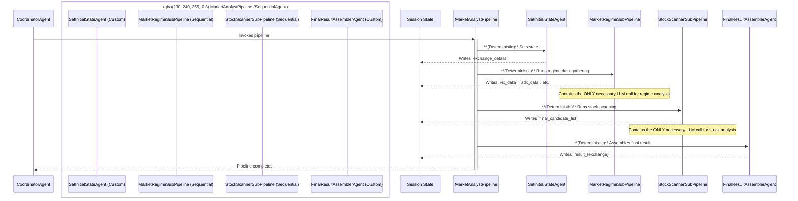

# ADR-0013: Deterministic-First Market Analyst Pipeline

**Date**: 2025-08-08

**Status**: Implemented

## Context

The `MarketAnalystPipeline` was initially designed with `LlmAgent`s for most of its sequential tasks. This architecture, while functional, led to several issues:
- **High Latency**: Each step involving an `LlmAgent` incurred a network roundtrip to the Gemini API.
- **Rate Limiting**: The high frequency of API calls increased the risk of hitting rate limits.
- **Cost**: Every LLM call has an associated financial cost.
- **Non-Determinism**: Simple tasks like tool calling were subject to the LLM's interpretation, leading to potential brittleness.

The goal was to refactor the pipeline to be hyper-efficient, reliable, and cost-effective by using LLMs only for tasks that require complex reasoning and synthesis.

## Decision

We have decided to refactor the `MarketAnalystPipeline` to adopt a "deterministic-first" approach. This involves replacing all `LlmAgent`s responsible for simple tool-calling with custom `BaseAgent`s that execute this logic in pure Python code.

The new architecture is composed of the following key components:

1.  **`CustomToolCallingAgent`**: A reusable, deterministic agent that takes a specific tool in its constructor and calls it directly. This agent is used for simple, single-tool-calling steps.

2.  **`StockDataEnrichmentAgent`**: A custom, deterministic agent that orchestrates a multi-step tool-calling process in code: it first finds pre-market movers and then iterates through the results to fetch detailed data for each stock.

3.  **Refactored Sub-Pipelines**:
    - `MarketRegimeSubPipeline`: Now uses `CustomToolCallingAgent` instances for parallel data gathering (`VIX`, `ADX`, `Time`). The `regime_synthesizer` remains an `LlmAgent`, as it performs a complex synthesis task.
    - `StockScannerSubPipeline`: Now consists of only two steps: the deterministic `StockDataEnrichmentAgent` followed by the `synthesis_scanner` `LlmAgent`, which analyzes the fully enriched data.

## Envisioned Workflow

## Consequences

- **Positive**:
    - **Reduced LLM Calls**: The number of LLM calls per pipeline run is reduced to the absolute minimum (two).
    - **Increased Speed**: The pipeline is significantly faster due to the elimination of network latency for most steps.
    - **Improved Reliability**: The pipeline is more deterministic and less prone to errors from LLM misinterpretations.
    - **Lower Cost**: Fewer LLM calls result in lower operational costs.

- **Negative**:
    - The `CoordinatorAgent` must be robust enough to handle cases where all parallel pipelines fail. The fan-in logic needs to explicitly check for an empty result set and return a final "error" status if no pipelines succeeded.
