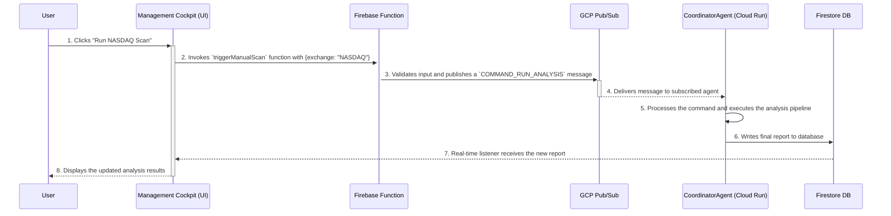

# UI Interaction Patterns

This document defines the architectural pattern for how the user-facing UI (the "Management Cockpit") interacts with the backend trading engine to trigger actions and receive updates.

## 1. Interaction Philosophy: Asynchronous Commands

All actions initiated by a user in the UI that require processing by the trading engine are handled asynchronously. This ensures the UI remains responsive and the system is resilient. The user does not directly call the agent service; instead, they dispatch a command message which the agent system will process.

## 2. User-Initiated Command Flow

This sequence diagram illustrates the end-to-end flow for a user-initiated command, such as manually triggering a pre-market analysis for a specific exchange.



## 3. Command Message Schema

All user-initiated commands published to the Pub/Sub topic will follow a standard schema. This ensures that the consuming agent can correctly interpret the request.

**Topic:** `agent-commands`

**Example Message: `COMMAND_RUN_ANALYSIS`**

```json
{
  "command_id": "string (UUID)",
  "command_type": "COMMAND_RUN_ANALYSIS",
  "issued_by_user_id": "string (Firebase Auth UID)",
  "timestamp_utc": "string (ISO 8601)",
  "parameters": {
    "exchanges": ["NASDAQ", "TSX"],
    "run_type": "Pre-Market"
  }
}
```

**Example Message: `COMMAND_FLATTEN_PORTFOLIO`**

```json
{
  "command_id": "string (UUID)",
  "command_type": "COMMAND_FLATTEN_PORTFOLIO",
  "issued_by_user_id": "string (Firebase Auth UID)",
  "timestamp_utc": "string (ISO 8601)",
  "parameters": {
    "portfolio_id": "string (UUID)",
    "reason": "Manual override by user."
  }
}
```
