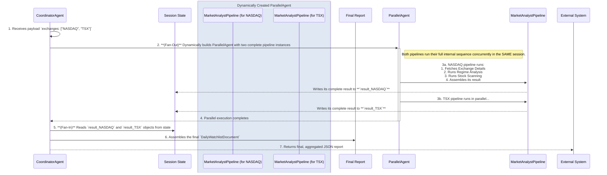

# ADR-0013: Pre-Market Analysis and Watchlist Generation Workflow

* **Status:** Accepted
* **Date:** 2025-08-06
* **Deciders:** Pierre Grothé, Tommy (AI Assistant)

## Context and Problem Statement

The AI Day Trading Agent requires a systematic, automated, and robust process to run before the market opens. The goal is to filter thousands of stocks across multiple exchanges down to a small, data-rich, and actionable watchlist of high-probability candidates for the day. This process must be efficient, scalable, and adhere to the strict, quantitative principles defined in the project's knowledge base.

## Decision Outcome

**Chosen option:** "**Serverless Fan-Out/Fan-In Pipeline via Pub/Sub**", because this architecture provides true, scalable parallelism, which is essential for completing scans of multiple exchanges efficiently before the market opens. It aligns perfectly with our event-driven and serverless principles (ADR-0004, ADR-0012) and directly implements the modularity and hierarchical control from the knowledge base \[cite: 01\_system\_architecture\_blueprint.md\].

### Positive Consequences

* **True Parallelism & Efficiency:** Each exchange is processed by a separate, independent Cloud Run instance, drastically reducing the total time required for pre-market analysis.
* **Scalability:** Adding new markets is a simple configuration change in Firestore. Cloud Run will automatically scale the number of parallel workers to match the workload.
* **Reliability & Resilience:** Using Pub/Sub decouples the components. If a scan for one exchange fails, it can be retried without impacting the others. The root `CoordinatorAgent` is designed to be resilient, yielding a final "error" status if all child pipelines fail, ensuring the system doesn't produce an empty success report.

### Negative Consequences

* **Increased Observability Complexity:** Debugging requires tracing a request across multiple services (Scheduler -> Pub/Sub -> Cloud Run), making structured logging (ADR-0011) essential.
* **Dependency Management:** The system is critically dependent on the availability of the EODHD API, Pub/Sub, and Firestore during the pre-market window.

### Appendix A: Detailed Workflow Diagram



### Appendix B: Agent & Service Definitions

#### CoordinatorAgent (Root Agent)

*   **ADK Class:** `BaseAgent` (custom implementation).
*   **Task:**
    1.  Receives a JSON payload with a list of exchanges.
    2.  Dynamically constructs a `ParallelAgent`.
    3.  For each exchange, it instantiates a complete `MarketAnalystPipeline` worker and adds it to the `ParallelAgent`.
    4.  Executes the `ParallelAgent`.
    5.  After completion, it "fans-in" the results from each pipeline from the session state.
    6.  Aggregates the results into a single `DailyWatchlistDocument`.
    7.  Yields a final event with the aggregated document.

#### MarketAnalystPipeline (Worker Pipeline)

*   **ADK Class:** `SequentialAgent`.
*   **Input:** An `exchange` string (e.g., "NASDAQ") passed during instantiation.
*   **Task:** Execute the full analysis for a single exchange by running a sequence of sub-pipelines and agents. This pipeline is optimized to be "deterministic-first," using custom code-driven agents for tool calls to maximize efficiency and reliability.
*   **Internal Structure:**
    1.  **`SetExchangeParamAgent` (`BaseAgent`):** Sets the initial `exchange` parameter in the state.
    2.  **`CustomToolCallingAgent` (`BaseAgent`):** Deterministically calls the `get_exchange_details` tool.
    3.  **`MarketRegimeSubPipeline` (`SequentialAgent`):**
        *   Runs a `ParallelAgent` containing multiple `CustomToolCallingAgent`s to gather VIX, ADX, and time data deterministically.
        *   Runs a single `LlmAgent` to synthesize the gathered data into a `MarketRegimeState`.
    4.  **`StockScannerSubPipeline` (`SequentialAgent`):**
        *   Runs the `StockDataEnrichmentAgent` (`BaseAgent`) to deterministically execute the multi-step tool-calling logic for finding and enriching stock data.
        *   Runs a single `LlmAgent` to synthesize the enriched data into a `StockCandidateList`.
    5.  **`FinalResultAssemblerAgent` (`BaseAgent`):** Deterministically assembles the final `ExchangeAnalysisResult` from the outputs of the sub-pipelines.
*   **Output:** Writes a single, complete `ExchangeAnalysisResult` object to a unique key in the session state (e.g., `result_NASDAQ`).

### Appendix C: Detailed Data Schemas

*The following schemas represent the final, validated Pydantic models used in the implementation.*

#### DailyWatchlistDocument (Final Output)

*This is the schema for the single, aggregated document returned by the `CoordinatorAgent` at the end of the run.*

```json
{
  "analysis_timestamp_utc": "string (ISO 8601)",
  "exchanges_scanned": [
    "string"
  ],
  "analysis_results": [
    {
      "market_regime": "MarketRegimeState (see below)",
      "candidate_list": [
        "StockCandidateObject (see below)"
      ]
    }
  ]
}
```

#### ExchangeAnalysisResult (Result of one worker pipeline)

```json
{
  "market_regime": {
    "exchange": "string",
    "vix_value": "float",
    "vix_state": "string",
    "adx_value": "float",
    "adx_state": "string",
    "time_of_day_state": "string",
    "regime_code": "string",
    "timestamp": "string (ISO 8601)"
  },
  "candidate_list": [
    "StockCandidateObject (see below)"
  ]
}
```

#### StockCandidateObject (A single stock in the watchlist)

*This is the detailed schema for each individual stock object.*

```json
{
  "code": "string",
  "name": "string",
  "exchange": "string",
  "sector": "string",
  "industry": "string",
  "adjusted_close": "float",
  "market_capitalization": "integer",
  "pre_market_high": "float",
  "pre_market_low": "float",
  "status": "string",
  "status_reason": "string",
  "correlation_cluster_id": "string",
  "pipeline_scores": [
      {
          "name": "string",
          "value": "float"
      }
  ],
  "catalyst_details": [
    {
      "type": "string",
      "headline": "string",
      "source": "string",
      "timestamp": "string (ISO 8601)"
    }
  ]
}
```
