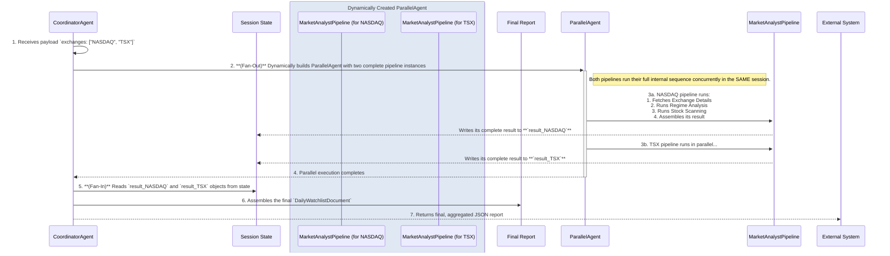

# ADR-0013: Pre-Market Analysis and Watchlist Generation Workflow

* **Status:** Accepted
* **Date:** 2025-08-06
* **Deciders:** Pierre Grothé, Tommy (AI Assistant)

## 1. Context and Problem Statement

The AI Day Trading Agent requires a systematic, automated, and robust process to run during the **Pre-Market** state (7:00 - 9:30 ET) as defined in `01_daily_routine_and_cadence.md`. The goal is to execute a multi-stage data processing pipeline that filters thousands of stocks across multiple exchanges down to a small, data-rich, and actionable watchlist of high-probability candidates. This process must be efficient, scalable, and adhere to the strict, quantitative principles for identifying "stocks in play" detailed in `02_pre_market_scanning_and_watchlist.md`. The final output must be a structured, machine-readable object ready for the trade execution and selection modules.

## 2. Decision Outcome

**Chosen option:** "**Serverless Fan-Out/Fan-In Pipeline via Pub/Sub**", because this architecture provides true, scalable parallelism, which is essential for completing scans of multiple exchanges efficiently before the market opens. It aligns perfectly with our event-driven and serverless principles defined in `01_system_architecture_blueprint.md` and directly implements the modularity and hierarchical control required. This architecture is the most resilient and efficient way to execute the multi-stage filtering and analysis pipeline.

### Positive Consequences

* **True Parallelism & Efficiency:** Each exchange is processed by a separate, independent Cloud Run instance, drastically reducing the total time required for pre-market analysis.
* **Scalability:** Adding new markets is a simple configuration change in Firestore. Cloud Run will automatically scale the number of parallel workers to match the workload.
* **Reliability & Resilience:** Using Pub/Sub decouples the components. If a scan for one exchange fails, it can be retried without impacting the others. The root `CoordinatorAgent` is designed to be resilient, yielding a final "error" status if all child pipelines fail, ensuring the system doesn't produce an empty success report.

### Negative Consequences

* **Increased Observability Complexity:** Debugging requires tracing a request across multiple services (Scheduler -> Pub/Sub -> Cloud Run), making structured logging essential.
* **Dependency Management:** The system is critically dependent on the availability of the EODHD API, Pub/Sub, and Firestore during the pre-market window.

## 3. Detailed Algorithmic Workflow & Agent Definitions

The pre-market workflow is a sequential pipeline executed by the `MarketAnalystPipeline` for each target exchange. The root `CoordinatorAgent` orchestrates this process in parallel across all exchanges.

### Appendix A: Detailed Workflow Diagram



### Appendix B: Agent & Service Definitions

#### CoordinatorAgent (Root Agent)

* **ADK Class:** `BaseAgent` (custom implementation).
* **Task:**
    1. Receives a JSON payload with a list of exchanges.
    2. Dynamically constructs a `ParallelAgent`.
    3. For each exchange, it instantiates a complete `MarketAnalystPipeline` worker and adds it to the `ParallelAgent`.
    4. Executes the `ParallelAgent`.
    5. After completion, it "fans-in" the results from each pipeline from the session state.
    6. Aggregates the results into a single `DailyWatchlistDocument`.
    7. Yields a final event with the aggregated document.

#### MarketAnalystPipeline (Worker Pipeline)

* **ADK Class:** `SequentialAgent`.
* **Input:** An `exchange` string (e.g., "NASDAQ") passed during instantiation.
* **Task:** Execute the full analysis for a single exchange. This pipeline is optimized to be "deterministic-first," using custom code-driven agents for tool calls to maximize efficiency and reliability.
* **Internal Structure & Algorithmic Steps:**

    1. **`SetExchangeParamAgent` (`BaseAgent`):** Sets the initial `exchange` parameter in the state.
    2. **`MarketRegimeSubPipeline` (`SequentialAgent`):** This sub-pipeline establishes the broad market context before any stock-specific analysis.
        * Runs a `ParallelAgent` containing multiple `CustomToolCallingAgent`s to gather:
            * **VIX Value:** For market volatility state (`Low`, `Medium`, `High`). [cite: 05\_market\_regime\_analysis\_module.md]
            * **ADX Value:** For market trend state (`Ranging`, `Trending`). [cite: 05\_market\_regime\_analysis\_module.md]
            * **Time of Day:** To determine the market phase (`Pre-Market`). [cite: 01\_daily\_routine\_and\_cadence.md]
        * Runs a single `LlmAgent` to synthesize the gathered data into a `MarketRegimeState` object and store it in the session state.

    3. **`StockScannerSubPipeline` (`SequentialAgent`):** This is the core filtering and enrichment pipeline.
        * **Stage 1: Static Universe Filtering (`BaseAgent`):** Executes a tool that filters all stocks on the exchange based on the following rules from `02_pre_market_scanning_and_watchlist.md`:
            * `Average Daily Volume (90-day) > 1,000,000 shares`
            * `Last Closing Price > $5.00 AND Last Closing Price < $200.00`
            * `Average True Range (ATR, 14-day) > $0.50`
        * **Stage 2: Dynamic Gapper Scanning (`BaseAgent`):** Executes a tool against the "Tradable Universe" to identify gappers based on:
            * `Gap Percentage >= 2.0%`
            * `Pre-Market Volume >= 100,000 shares` (by 9:00 AM ET)
            * **Relative Volume (RVOL) > 1000% (10x)** of its 30-day historical average for the same time of day. [cite: 02\_pre\_market\_scanning\_and\_watchlist.md]
        * **Stage 3: Catalyst Identification and Scoring (`BaseAgent`):** For each identified gapper, this agent runs an NLP pipeline tool as defined in `02_pre_market_scanning_and_watchlist.md`:
            * Queries a news API for headlines in the last 18 hours.
            * Classifies news using a FinBERT model (`Earnings Beat`, `M&A Offer`, `FDA Approval`).
            * Assigns a quantitative `Catalyst_Score` (1-10) and populates the `catalyst_details` field in the `StockCandidateObject`.
        * **Stage 4: Final Ranking & Filtering (`LlmAgent`):** This agent synthesizes all the data for the gappers.
            * It calculates a final `Ranking_Score` using the weighted formula: `(Catalyst_Score * 0.40) + (RVOL_Score * 0.30) + (Gap_Score * 0.15) + (Chart_Clarity_Score * 0.15)`. [cite: 02\_pre\_market\_scanning\_and\_watchlist.md]
            * It performs a final risk filter as per `05_advanced_trade_selection_algorithm.md`, discarding any candidate where:
                * `ATR (14-day) > 5% of Current_Price`
                * `Average Dollar Volume (30-day) < $20,000,000`
            * The output is a ranked list of enriched `StockCandidateObject`s, which is stored in the session state as a `StockCandidateList`.

    4. **`FinalResultAssemblerAgent` (`BaseAgent`):** Deterministically assembles the final `ExchangeAnalysisResult` from the `MarketRegimeState` and `StockCandidateList` in the session state.
* **Output:** Writes a single, complete `ExchangeAnalysisResult` object to a unique key in the session state (e.g., `result_NASDAQ`).

### Appendix C: Detailed Data Schemas

*The following schemas represent the final, validated Pydantic models used in the implementation, derived from the knowledge base.*

#### DailyWatchlistDocument (Final Output)

*This is the schema for the single, aggregated document returned by the `CoordinatorAgent` at the end of the run.*

```json
{
  "analysis_timestamp_utc": "string (ISO 8601)",
  "exchanges_scanned": [
    "string"
  ],
  "analysis_results": [
    {
      "market_regime": "MarketRegimeState (see below)",
      "candidate_list": [
        "StockCandidateObject (see below)"
      ]
    }
  ]
}
```

#### ExchangeAnalysisResult (Result of one worker pipeline)

```json
{
  "market_regime": {
    "exchange": "string",
    "vix_value": "float",
    "vix_state": "string",
    "adx_value": "float",
    "adx_state": "string",
    "time_of_day_state": "string",
    "regime_code": "string",
    "timestamp": "string (ISO 8601)"
  },
  "candidate_list": [
    "StockCandidateObject (see below)"
  ]
}
```

#### StockCandidateObject (A single stock in the watchlist)

*This is the detailed schema for each individual stock object, synthesized from `02_pre_market_scanning_and_watchlist.md` and other documents.*

```json
{
  "ticker": "string",
  "name": "string",
  "exchange": "string",
  "sector": "string",
  "industry": "string",
  "rank": "integer",
  "overall_score": "float",
  "adjusted_close": "float",
  "market_capitalization": "integer",
  "pre_market_high": "float",
  "pre_market_low": "float",
  "key_daily_resistance": "float",
  "status": "string",
  "status_reason": "string",
  "correlation_cluster_id": "string",
  "pipeline_scores": [
      {
          "name": "catalyst_score",
          "value": "float"
      },
      {
          "name": "rvol_score",
          "value": "float"
      },
      {
          "name": "gap_score",
          "value": "float"
      },
      {
          "name": "chart_clarity_score",
          "value": "float"
      }
  ],
  "catalyst_details": [
    {
      "type": "string",
      "headline": "string",
      "source": "string",
      "timestamp": "string (ISO 8601)"
    }
  ]
}
