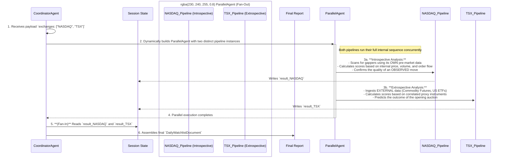

# [CONCEPT: Pre_Market_Framework] Pre-Market Analysis Framework: A Deep Dive

This document provides the definitive, end-to-end technical blueprint for the AI agent's pre-market analysis and watchlist generation pipeline. It synthesizes and expands upon the principles from the knowledge base and architectural decision records, incorporating advanced quantitative metrics and market-specific models.

## 1. End-to-End Algorithmic Workflow

The pre-market analysis is orchestrated by a root `CoordinatorAgent` that fans out analysis tasks to market-specific worker pipelines. The fundamental difference between exchange mechanisms (e.g., NASDAQ's active pre-market vs. TSX's pre-open auction) requires two distinct analytical models.



## 2. Data Sourcing & Catalyst Identification Playbook

A potent catalyst is the primary driver of pre-market activity. The agent must move beyond simple news headlines to create a "narrative strength" score by synthesizing signals from a diverse portfolio of traditional and alternative data sources.

### 2.1 Foundational Data (EODHD)

- **Real-Time Pricing:** EODHD's WebSocket service (`us` endpoint) is the source for real-time L1 data for NASDAQ pre-market movers.
- **Fundamentals & Historical Data:** The `eodhdc.get_fundamental_equity()` function provides essential data for the initial universe filter, such as 90-day average volume and market capitalization.
- **News Catalyst:** The `eodhdc.get_financial_news_and_sentiment_data()` function provides the baseline news headlines and a preliminary sentiment score.

### 2.2 Alternative Data for "Narrative Strength"

A high `Catalyst_Score` is derived from a coherent theme emerging from multiple data sources. The agent should be equipped with tools to query the following:

- **SEC Filings (via sec-api.io or similar):**
  - **Form 8-K:** Detects unscheduled material events. Keywords like "acquisition," "bankruptcy," or "internal investigation" are high-impact.
  - **Forms 3, 4, 5:** Identifies clusters of insider buying or selling. A single purchase is noise; a cluster of buys is a strong bullish signal.
  - **Form 13F-HR:** Reveals institutional accumulation by "smart money," albeit with a time lag.

- **Social Sentiment (via StockTwits, Reddit API):**
  - **Sentiment Delta:** The agent must track the *rate of change* of sentiment scores, not just the absolute level.
  - **Volume Spike:** Monitor for a statistically significant increase in the volume of mentions for a specific ticker.
  - **Keyword Emergence:** Scan for the appearance of high-impact keywords (e.g., "short squeeze," "data breach," "product recall").

- **Sector-Specific Catalysts (Biotech Blueprint):**
  - **Clinical Trial Data:** Use specialized databases (e.g., BPIQ, FDATracker) to track clinical trial phases, PDUFA dates, and data readouts.
  - **Catalyst Run-Up:** The `Catalyst_Score` should be a time-series feature that increases in value as a known catalyst date approaches, allowing the model to learn the "buy the rumor" phenomenon.

## 3. Quantitative Scoring Engine: The Chart Clarity Score

The `Chart_Clarity_Score` is a composite, weighted average of seven distinct, quantifiable metrics designed to assess the quality and predictability of a pre-market consolidation. It is not a standalone trading signal but a sophisticated filter to ensure the agent only engages with the most orderly and high-probability setups. The calculation is liquidity-dependent, with weights adjusted based on the stock's average daily volume (ADV).

### 3.1 Normalization and Weighting

Before aggregation, each of the seven component scores must be normalized to a common scale (e.g., 0 to 100) using a percentile rank or min-max scaling over a recent lookback period. The final score is a weighted average, with the following as a robust starting point:

- **Volume-Based Metrics (40%):** Volume is the ultimate arbiter of conviction.
- **Price Action Metrics (30%):** The geometric structure and character of the price action.
- **Order Flow Metrics (30%):** The most granular confirmation of participant intent.

### 3.2 The Seven Core Metrics

| Metric Name | Abbreviation | Category | Core Concept | Key Data Inputs |
| :--- | :--- | :--- | :--- | :--- |
| **Range Integrity Score** | RIS | Price Action | How well price respects support/resistance boundaries. | Price (High, Low, Close) |
| **Price Action Rhythm Score** | PRS | Price Action | The orderliness and symmetry of price swings within the range. | Price (OHLC) |
| **Volatility Character Score** | VCS | Price Action | The *nature* of volatility (constructive vs. erratic). | Price (OHLC), ADX, BBW |
| **Volume Profile Structure Score** | VPSS | Volume | The clarity and consensus shown in the volume-at-price distribution. | Price, Volume |
| **Volume Trend & Confirmation Score** | VTCS | Volume | The dynamic behavior of volume over time during the consolidation. | Volume |
| **Order Flow Absorption Score** | OFAS | Order Flow | Strength of S/R based on absorption of aggressive orders. | Level 2 / Footprint Data |
| **Cumulative Volume Delta Score** | CVDS | Order Flow | Net buying/selling pressure and its divergence from price. | Level 2 / Footprint Data |

### 3.3 Metric Calculation Deep Dive

- **Range Integrity Score (RIS):** Penalizes frequent, deep, and prolonged breaches of the defined consolidation range. Calculated from `Breach_Count`, `Breach_Depth` (as a multiple of ATR), and `Time_Outside_Range`.

- **Price Action Rhythm Score (PRS):** Measures the consistency of swings between support and resistance. Calculated from `Swing_Symmetry` (std. dev. of swing duration and amplitude), `Candle_Overlap_Ratio`, and `Wick_to_Body_Ratio`.

- **Volatility Character Score (VCS):** Rewards constructive volatility compression. Calculated from `ADX_Score` (low ADX is good), `BBW_Score` (low Bollinger Band Width is good), and `CHOP_Score` (high but declining Choppiness Index is good).

- **Volume Profile Structure Score (VPSS):** Measures the clarity of the volume distribution. Calculated from `Profile_Shape` (rewards a clean "D-shape"), `POC_Prominence`, and `VA_Compactness` (Value Area).

- **Volume Trend & Confirmation Score (VTCS):** Rewards a declining volume trend during consolidation followed by a sharp increase on the breakout (a "J-curve"). Calculated from `Volume_Trend_Slope` and `Volume_at_Boundaries`.

- **Order Flow Absorption Score (OFAS):** Measures absorption at key levels using footprint chart data. Rewards patterns where high selling pressure at support (or buying at resistance) fails to move the price.

- **Cumulative Volume Delta (CVDS) Score:** Rewards constructive divergences between price and CVD (e.g., price making lower lows while CVD makes higher lows during a pullback).

### 4.1 NASDAQ/NYSE Configuration: Introspective Model

- **Primary Data:** Stock's own pre-market price, volume, and order flow data.
- **Ranking Factors:**
    1. `Chart_Clarity_Score` (70%)
    2. `Catalyst_Strength_Score` (30%)

### 4.2 Global Auction-Based Exchange Configuration: Extrospective Model

This model applies to TSX, LSE, Euronext, Deutsche Börse, JPX, HKEX, and SSE.

- **Primary Data:** Pre-market data from the most liquid, relevant **US-listed ETF** that tracks the foreign market (e.g., EWU for the UK).
- **Ranking Factors (Core Model - EODHD Data):**
    1. `Macro_Catalyst_Score` (60%): Calculated as `(Proxy_ETF_%_Change) * (Historical_Correlation_to_Stock)`.
    2. `US_Sector_Sentiment_Score` (40%): Based on the pre-market performance of the corresponding US sector ETF.

### 4.3 Data Dependencies and Hybrid Provider Strategy

The analysis pipeline is designed with a multi-tier data strategy to maximize both cost-efficiency and analytical depth.

- **Tier 1 (Foundational Data - EODHD):** The existing "All-In-One" subscription is used for all non-real-time data needs: deep historical price data for backtesting, fundamental data for filtering, and news feeds for the baseline `Catalyst_Score`.
- **Tier 2 (Real-Time Data - Interactive Brokers):** The IBKR Pro account is the primary source for all live, real-time data. This includes Level 1 quotes and, crucially, the **Level 2 (Market-by-Price) data** required to calculate the majority of the `Chart_Clarity_Score` metrics.
- **Tier 3 (Level 3 Edge - Databento/dxFeed):** To enable the most advanced order flow metrics (`OFAS`, `CVDS`, `Order_Imbalance_Score`), a subscription to a specialist Level 3 (Market-by-Order) data provider is required. This is considered a key strategic enhancement to be implemented after the core system is operational.

The agent must be architected to load a market-specific configuration file that dictates the entire pre-market analysis pipeline. The fundamental distinction is between **Introspective** models for markets with active pre-market trading and **Extrospective** models for markets that use an opening auction.

| Exchange | Model Philosophy | Primary Proxies / Data Source | Key Ranking Factors |
| :--- | :--- | :--- | :--- |
| **NASDAQ** | **Introspective, Confirmatory** | Stock's own pre-market price, volume, and order flow data. | 1. `Chart_Clarity_Score` (70%) <br> 2. `Catalyst_Strength_Score` (30%) |
| **NYSE** | **Introspective, Confirmatory** | Stock's own pre-market price, volume, and order flow data. | 1. `Chart_Clarity_Score` (70%) <br> 2. `Catalyst_Strength_Score` (30%) |
| **TSX (Canada)** | **Extrospective, Predictive** | EWC (ETF), /SXF (Futures), WTI Crude, Gold Futures. | 1. `Macro_Catalyst_Score` (50%) <br> 2. `US_Sector_Sentiment_Score` (30%) <br> 3. `Order_Imbalance_Score` (20%) |
| **LSE (UK)** | **Extrospective, Predictive** | EWU (UK ETF), FTSE 100 Futures. | 1. `Macro_Catalyst_Score` (50%) <br> 2. `US/EU_Sector_Sentiment` (30%) <br> 3. `Order_Imbalance_Score` (20%) |
| **Euronext** | **Extrospective, Predictive** | VGK (Europe ETF), Euro Stoxx 50 Futures. | 1. `Macro_Catalyst_Score` (50%) <br> 2. `US_Sector_Sentiment` (30%) <br> 3. `Order_Imbalance_Score` (20%) |
| **Deutsche Börse** | **Extrospective, Predictive** | DAX (Germany ETF), DAX Futures. | 1. `Macro_Catalyst_Score` (50%) <br> 2. `US/EU_Sector_Sentiment` (30%) <br> 3. `Order_Imbalance_Score` (20%) |
| **JPX (Japan)** | **Extrospective, Predictive** | EWJ (Japan ETF), Nikkei 225 Futures. | 1. `Macro_Catalyst_Score` (60%) <br> 2. `Overnight_Sentiment_Score` (40%) |
| **HKEX (Hong Kong)**| **Extrospective, Predictive** | FXI (China Large-Cap ETF), Hang Seng Futures. | 1. `Macro_Catalyst_Score` (60%) <br> 2. `China_A50_Sentiment` (40%) |
| **SSE (Shanghai)** | **Extrospective, Predictive** | ASHR (CSI 300 ETF), FTSE China A50 Futures. | 1. `Macro_Catalyst_Score` (60%) <br> 2. `HK_Sentiment_Score` (40%) |

### 4.1 NASDAQ Configuration: An Introspective, Confirmatory Model

The objective is to validate the quality of an *observed* pre-market move.

- **Model Philosophy:** Introspective, Confirmatory.
- **Primary Data Source:** Real-time price and volume data for the specific stock from the NASDAQ feed.
- **Key Filters:**
  - Absolute Pre-Market Volume > 200,000 shares.
  - Gap % > 4% and < 50%.
  - Presence of a news catalyst in the last 12 hours.
- **Ranking/Scoring Weights:**
  - **`Chart_Clarity_Score` (All 7 metrics):** Given the rich data, the full score is used as the primary ranking factor.
  - **`Catalyst_Strength_Score`:** A secondary factor to differentiate between high-clarity setups.

### 4.2 TSX Configuration: An Extrospective, Predictive Model

The objective is to *predict* the opening auction outcome based on external, correlated factors.

- **Model Philosophy:** Extrospective, Predictive.
- **Primary Data Source:** Real-time data for external proxies (e.g., WTI Crude Futures for energy stocks, S&P 500 Futures, iShares MSCI Canada ETF `EWC`).
- **Key Filters:**
  - Historical Correlation (Stock vs. Proxy) > 0.7.
  - Proxy Instrument % Change > 1.5%.
  - Proxy Instrument Relative Volume > 2x.
- **Ranking/Scoring Weights:**
  - **`Macro_Catalyst_Score` (50%):** The core of the model. Calculated as `(Proxy_%_Change) * (Historical_Correlation)`.
  - **`US_Sector_Sentiment_Score` (30%):** Based on the pre-market performance of the corresponding US sector ETF (e.g., XLF for banks).
  - **`Order_Imbalance_Score` (20%):** If available, the buy/sell ratio at the Calculated Opening Price (COP) is a powerful final confirmation.

| Parameter Type | NASDAQ Configuration | TSX Configuration |
| :--- | :--- | :--- |
| **Model Philosophy** | Introspective, Confirmatory | Extrospective, Predictive |
| **Primary Data** | Individual stock's pre-market data | External Proxies (Futures, ETFs) |
| **Output Goal** | Identify stocks with a confirmed trend | Predict stocks with a likely opening gap |

## 5. The ML-Powered Adaptive Ranking Loop

To prevent alpha decay and adapt to changing market regimes, the agent must learn from its daily performance. This is achieved via a post-market, closed-loop system that uses machine learning to refine the pre-market ranking algorithm. The architecture moves beyond a simple linear model to a more sophisticated **meta-labeling** framework, which decouples the prediction of *what* will happen from the *confidence* in that prediction.

### 5.1 Architecture: Meta-Labeling for Confidence Estimation

The system involves two distinct models:

1. **Primary Model (The "Side" Predictor):**
    - **Algorithm:** A powerful, non-linear model like **LightGBM** or **XGBoost**.
    - **Features:** Trained on the rich, multi-source feature set engineered for each stock in the pre-market (technical indicators, `Chart_Clarity_Score` components, catalyst data, etc.).
    - **Target:** Predicts the *direction* of the trade (+1 for long, -1 for short). The labels are generated using the **Triple-Barrier Method**, which defines outcomes based on volatility-adjusted profit-take and stop-loss levels, providing a more robust target than a fixed-time horizon return.
    - **Question it Answers:** "Should I be long or short?"

2. **Secondary Model (The "Size" or "Confidence" Predictor):**
    - **Algorithm:** A simple, well-calibrated classifier like **Logistic Regression**.
    - **Features:** It uses a subset of the original features, but crucially, it also includes the **out-of-sample prediction from the Primary Model** as a feature.
    - **Target:** Predicts whether the Primary Model's prediction was correct (1 for correct, 0 for incorrect).
    - **Question it Answers:** "How confident am I in the primary model's prediction?"

#### Meta-Model Feature Set

The goal of the meta-model is to learn the *conditions* under which the primary model is most reliable. Its feature set is therefore designed to capture the context of the primary prediction:

- **Primary Model Prediction:** The raw probability or score from the primary GBM model for the predicted class (e.g., the probability of label `+1`).
- **Market Regime Features:** The broad market context at the time of prediction.
  - `vix_value`: The raw VIX value.
  - `adx_value`: The raw ADX value.
  - `time_of_day_state`: Cyclical features representing the time of day.
- **Signal Strength & Quality Features:** Key metrics that describe the quality of the setup.
  - The seven normalized component scores of the `Chart_Clarity_Score` (RIS, PRS, VCS, VPSS, VTCS, OFAS, CVDS).
  - `Catalyst_Strength_Score`: The quantitative score of the news catalyst.
  - `RVOL`: The final relative volume of the pre-market session.
- **Volatility & Risk Features:**
  - `ATR_14_period`: The Average True Range, indicating expected volatility.
  - `Bollinger_Band_Width`: The normalized width of the Bollinger Bands, indicating volatility compression.

### 5.2 Application: Dynamic, Confidence-Based Ranking

The probabilistic output from the secondary "confidence" model (a score from 0 to 1) is integrated directly into the final ranking score:

- **Initial Rank:** The Primary Model provides the initial directional score.
- **Confidence Filtering:** Any trade signal where the meta-model's confidence is below a threshold (e.g., 0.60) is discarded.
- **Ranking Adjustment:** The final rank is adjusted based on confidence. A formula like `Final_Rank = Primary_Score * (Meta_Confidence - 0.5)` heavily penalizes low-confidence predictions and boosts high-confidence ones.
- **Probabilistic Bet Sizing:** The confidence score can be used to dynamically size positions, allocating more capital to high-confidence setups.

### 5.3 The Continuous Learning Loop (MLOps)

This architecture operates within an automated, post-market pipeline:

1. **Live Performance Monitoring:** The agent continuously tracks the financial performance (e.g., Sharpe Ratio) of its live trades.
2. **Automated Decay Detection:** A statistical trigger flags the live model as "decayed" if its performance drops significantly below the backtested expectation.
3. **Triggered Retraining Pipeline:** The decay flag automatically triggers a full, automated retraining of both the primary and meta-models on the most recent data, ensuring the system adapts to the evolving market.

## 7. Applied Analytical Scenarios

This section provides concrete, step-by-step examples of the analysis pipeline in action for different market scenarios.

### Scenario 1: NASDAQ Introspective Analysis (e.g., AAPL reports positive earnings)

- **Context:** At 8:00 AM ET, a news event is detected for `AAPL.US`. The stock is gapping up 5% on 150,000 shares of pre-market volume.
- **Objective:** Confirm if the observed move is legitimate and has a high probability of continuation.

1. **Initial Filtering (CoordinatorAgent):**
    - `Last Closing Price`: $190 (Passes: >$5, <$200).
    - `Average Daily Volume (90-day)`: 80M shares (Passes: >1M).
    - `ATR (14-day)`: $3.50 (Passes: >$0.50).
    - `Pre-Market Volume`: 150,000 (Passes: >100k by 9:00 AM).
    - `Gap Percentage`: +5% (Passes: >= 2.0%).
    - **Result:** AAPL is added to the watchlist for the `NASDAQ_Pipeline`.

2. **Data Ingestion (NASDAQ_Pipeline):**
    - The pipeline begins streaming 1-minute OHLCV bars and news updates for AAPL from the EODHD WebSocket and News API.

3. **Quantitative Scoring (Ongoing until 9:25 AM ET):**
    - **`Catalyst_Score`:** The NLP tool processes the headline: "Apple posts record Q3 revenue, beats EPS estimates." It assigns a high score (e.g., 9/10).
    - **`Chart_Clarity_Score` (5/7 Metrics):** The agent continuously calculates the scores based on the evolving 1-minute pre-market data.
        - `RIS`: High (price is respecting a tight flag pattern).
        - `PRS`: High (swings are rhythmic).
        - `VCS`: High (volatility is low and contracting within the flag).
        - `VPSS`: High (a clear Point of Control is forming at the upper end of the range).
        - `VTCS`: High (volume is declining during the consolidation).
    - **`[L2 DATA GAP]`**: The `OFAS` and `CVDS` scores are currently assigned a neutral value of 50, as EODHD does not provide the required Level 2 data.

4. **Final Ranking (9:25 AM ET):**
    - The final, normalized scores are aggregated using the weighted formula.
    - AAPL receives a high final rank and is placed at the top of the `DailyWatchlistDocument`.

### Scenario 2: TSX Extrospective Analysis (e.g., WTI Crude oil gaps up 3% overnight)

- **Context:** At 8:00 AM ET, the system detects a significant move in WTI Crude Futures (`/CL`). The target is Canadian energy stocks like `SU.TO` (Suncor Energy).
- **Objective:** Predict if the external catalyst will cause `SU.TO` to have a strong opening gap.

1. **Initial Filtering (CoordinatorAgent):**
    - The agent queries its database for all TSX stocks with a historical correlation > 0.7 to `/CL`. `SU.TO` is on this list.
    - **Result:** `SU.TO` is added to the watchlist for the `TSX_Pipeline`.

2. **Proxy Data Ingestion (TSX_Pipeline):**
    - The pipeline begins streaming pre-market data for the primary US-listed oil ETF, `USO`, from the EODHD `us` WebSocket.

3. **Quantitative Scoring (Ongoing until 9:25 AM ET):**
    - **`Macro_Catalyst_Score`:** The agent tracks the pre-market gap in `USO`. If `USO` is up 2.8% and its correlation to `SU.TO` is 0.85, a high score is generated.
    - **`US_Sector_Sentiment_Score`:** The agent checks the performance of the US energy sector ETF, `XLE`. If `XLE` is also gapping up, this provides a strong confirmation.
    - **`[L2 DATA GAP]`**: The `Order_Imbalance_Score` cannot be calculated. This is a critical missing piece for auction-based markets and requires a direct data feed from the TSX.

4. **Final Ranking (9:25 AM ET):**
    - The proxy-based scores are aggregated.
    - `SU.TO` receives a high rank, indicating a high probability of a gap up at the 9:30 AM open.

This section provides high-level Python pseudocode and ADK design patterns to guide the implementation of the pre-market analysis pipeline.

### 6.1 `CoordinatorAgent` (Custom `BaseAgent`)

The root agent orchestrates the parallel execution of market-specific pipelines.

```python
from google.adk.agents import BaseAgent, ParallelAgent
from google.adk.agents.invocation_context import InvocationContext

class CoordinatorAgent(BaseAgent):
    # ... (initialization of sub-agents) ...

    async def _run_async_impl(self, ctx: InvocationContext):
        exchanges = ctx.session.state.get("exchanges_to_scan", [])
        
        # 1. Fan-Out: Dynamically create a parallel pipeline
        pipelines = []
        for exchange in exchanges:
            if exchange == "NASDAQ":
                pipelines.append(self.nasdaq_pipeline_agent)
            elif exchange == "TSX":
                pipelines.append(self.tsx_pipeline_agent)
        
        parallel_scanner = ParallelAgent(name="ParallelScanner", sub_agents=pipelines)
        
        async for event in parallel_scanner.run_async(ctx):
            yield event

        # 2. Fan-In: Assemble results from session state
        final_results = []
        for exchange in exchanges:
            result = ctx.session.state.get(f"result_{exchange}")
            if result:
                final_results.append(result)
        
        # 3. Create and store the final watchlist document
        watchlist_doc = self.assemble_final_document(final_results)
        ctx.session.state["daily_watchlist"] = watchlist_doc
        yield self.create_final_event(watchlist_doc)
```

### 6.2 `MarketAnalystPipeline` (Deterministic `SequentialAgent`)

Each worker pipeline executes the analysis for a single exchange using a sequence of deterministic tools.

```python
from google.adk.agents import SequentialAgent
from google.adk.tools import FunctionTool

# --- Define Tools as Python Functions ---
def get_market_regime(tool_context, exchange):
    # ... logic to fetch VIX, ADX and determine regime ...
    regime = {"vix_state": "Medium", "adx_state": "Trending"}
    tool_context.state[f"regime_{exchange}"] = regime
    return regime

def run_stock_screener(tool_context, exchange, regime):
    # ... logic to run static and dynamic filters ...
    # ... calls catalyst and clarity scoring functions ...
    candidates = [{"ticker": "AAPL", "score": 85}, {"ticker": "MSFT", "score": 82}]
    tool_context.state[f"candidates_{exchange}"] = candidates
    return candidates

def assemble_exchange_result(tool_context, exchange):
    # ... logic to combine regime and candidates ...
    result = {"market_regime": ..., "candidate_list": ...}
    tool_context.state[f"result_{exchange}"] = result
    return result

# --- Build the Sequential Pipeline ---
nasdaq_pipeline_agent = SequentialAgent(
    name="NASDAQ_Pipeline",
    sub_agents=[
        FunctionTool(fn=get_market_regime, name="GetRegime"),
        FunctionTool(fn=run_stock_screener, name="RunScreener"),
        FunctionTool(fn=assemble_exchange_result, name="AssembleResult"),
    ]
)
```

### 6.3 `PostMarketMLAgent` (`LoopAgent` for Continuous Learning)

This agent runs post-market to analyze the day's performance and retrain the ranking model.

```python
from google.adk.agents import LoopAgent, LlmAgent

def analyze_trade_performance(tool_context):
    # ... logic to fetch daily trades and compare to watchlist ...
    # ... calculates which features led to winning trades ...
    performance_summary = {"top_feature": "catalyst_score", "status": "complete"}
    tool_context.state["performance_summary"] = performance_summary
    return performance_summary

def retrain_ranking_model(tool_context):
    # ... logic to trigger a Vertex AI training job ...
    # ... uses performance_summary to adjust feature weights ...
    training_job = {"job_id": "12345", "status": "running"}
    # Signal to stop the loop after one iteration
    tool_context.actions.escalate = True 
    return training_job

# --- Build the Loop Agent ---
post_market_agent = LoopAgent(
    name="PostMarketMLAgent",
    sub_agents=[
        LlmAgent(name="PerformanceAnalyzer", tools=[analyze_trade_performance]),
        LlmAgent(name="ModelRetrainer", tools=[retrain_ranking_model]),
    ],
    max_iterations=1 # Run the loop once per day
)
```
